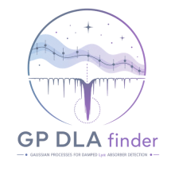

<div align="center">

<!--
  Plain Markdown image syntax, pointing at an SVG wrapper.

  Two renderer constraints have to hold at once:

    * Markdown image syntax carries no width attribute, so a PNG renders at its
      intrinsic size -- which is why the 1254px artwork filled the page.
    * raw HTML with a relative src has broken in GitHub's mobile app, so
       is not a safe way to set the size.

  The SVG satisfies both: it is referenced by the same Markdown syntax that
  works in the app, and it carries its own width/height, so the display size
  travels with the asset. The raster is embedded as a data URI, so nothing has
  to resolve a second relative path.

  Nothing is downsampled to achieve the layout: docs/_static/logo-{light,dark,
  universal}.png remain at the full 1254px source resolution. The wrapper
  embeds a 550px raster (2.5x the 220px display width) because a base64 copy of
  the full 1254px image made a 1MB banner.
-->


# gp_dla_finder

Gaussian-process Bayesian detection of damped Lyman-α absorbers in quasar
spectra.

<!--
  The workflow status badges are TEXT LINKS, not images.

  A private repository's badge SVG is only served to an authenticated request:
  https://github.com/<owner>/<repo>/actions/workflows/<file>/badge.svg returns
  404 without credentials. A browser session supplies them, so the badges look
  fine on github.com; the GitHub app's image loader does not, so they render as
  broken images there. The workflow paths are correct and both workflows are
  active -- this is authentication, not a bad URL.

  Restore the image badges if the repository ever becomes public, or if a
  cross-renderer solution is verified in GitHub web AND the app.

  The shields.io badges below stay images: they are served publicly and do not
  depend on repository access.
-->

CI: [tests](https://github.com/jibanCat/gp_dla_finder/actions/workflows/tests.yml)
· [canonical parity](https://github.com/jibanCat/gp_dla_finder/actions/workflows/parity.yml)
· [docs](https://github.com/jibanCat/gp_dla_finder/actions/workflows/docs.yml)
· [linux blas baseline](https://github.com/jibanCat/gp_dla_finder/actions/workflows/linux-baseline.yml)

[](https://opensource.org/licenses/MIT)


</div>

> [!WARNING]
> ## Status: `0.1.0`
>
> At the moment, the statistically supported workflow compares the null and
> one-absorber models for one spectrum at a time. The two-absorber model is also
> workable in a production workflow when you opt in. Its current statistical
> estimator remains experimental: it follows the reference implementation on
> the cases we have checked, but robust posterior inference, especially for
> close pairs, will need a more advanced sampler.
>
> Reported redshifts and column densities are the best evaluated grid points.
> They are useful for locating and inspecting a candidate, but they are
> preliminary rather than precision measurements, and the uncertainty fields
> are `NaN`.
>
> The `0.1.0` release is distributed through PyPI. The package is useful for
> candidate finding and method development, but the broader validation is not
> complete enough for unrestricted science production yet. What we have and
> have not checked is summarized in
> [docs/caveats.md](docs/caveats.md).

### What works today

You can give `Finder` one spectrum and get a typed `Result` back. The current
workflow includes the Voigt forward model, DESI and BOSS line-spread functions,
two trained GP models, per-spectrum mean-flux fitting, an absorber prior,
quasi-Monte-Carlo grids, quality policies, and the null-versus-one-absorber
evidence calculation. It can also write strict-legacy and extended FITS
catalogs.

```python
from gp_dla_finder import Config
from gp_dla_finder.finder import Finder

result = Finder().run(spectrum)  # null versus one absorber
result.status, result.p_absorber
```

The full walkthrough is in the [tutorial](docs/tutorial.md).

### What still needs work

**The two-absorber model runs, but its estimator is still experimental.** The
statistically supported path compares no absorber with one absorber. The
optional two-absorber model is workable in a production workflow and gives you
an M0/M1/M2 ladder, model posteriors, and both members of the preferred pair.
For v0.1, you need to opt in with both settings:

```python
Config.desi_y3_fast(max_absorbers=2, experimental_multi_absorber=True)
```

With a controlled seed, its evidences reproduce the reference implementation
bitwise, so it is useful for fidelity checks and development. The science
performance is less mature. In a small 60-spectrum benchmark it recovered the
right multiplicity about 80% of the time, with clear weaknesses for close
pairs (separation ~0.02 in redshift) and low-signal pairs. This is a bounded
test rather than a survey calibration, so the option remains `experimental`
and the catalogue records that status as `GPDLF_EXPERIMENTAL`.

The current sequential resampler should not be mistaken for a complete joint
posterior method. A sampler such as RJMCMC or nested sampling is the longer-term
route when absorber number and absorber parameters need to be inferred
together.

A two-absorber result **does** write to a catalogue: two ordinary rows sharing a
`TARGETID`, which is the flat form the reference itself uses. The model ladder
is not in the FITS file — FITS is the compact DESI catalogue — and travels in
the structured JSON output instead:

```python
from gp_dla_finder.io.fits import write_legacy_catalogue
from gp_dla_finder.io.structured import write_structured_results

write_legacy_catalogue("absorbers.fits", catalogue)  # the DESI catalogue
write_structured_results("run.json", catalogue)  # evidences, priors, ladder
```

Finder rejects configurations above two absorbers instead of quietly
truncating them.

**Parameter estimates are still preliminary.** A Result gives you the best
evaluated grid point, named `grid_z_abs` and `grid_log_nhi`. This is usable for
locating and inspecting a candidate, but it is not yet reliable enough to quote
as a science measurement. Posterior uncertainties remain `NaN`.

Survey I/O adapters and parallel execution over a survey are also outside the
current core package. You can provide the I/O yourself, but the convenient
survey-scale workflow still needs to be built.

### Which evidence path runs by default

By default, we run the **full configured QMC grid**. FILTER is a faster
truncated-prefix screening approximation, and you have to ask for it explicitly:

```python
Config.desi_y3(max_absorbers=1)  # full grid
Config.desi_y3(max_absorbers=1, filter_low_likelihood=True)  # opt-in screening
```

The API calls the full-grid path `"exact"`; in practice, this means the whole
configured grid. It is still a finite numerical calculation, not an analytic
integral with zero error. In a small set of 15 constructed examples, FILTER
changed the classification in three cases relative to the adopted
100,000-sample full-grid reference. That is useful as a warning near the
detection threshold, but it is not a survey error rate. See
[docs/filter.md](docs/filter.md).

### What has been verified

On generated spectra, the null and one-absorber log evidences reproduce the
reference implementation **bitwise**, including every per-sample likelihood,
under both named line-spread functions. The FILTER path also reproduces the
reference `FILTER=1` result bitwise. The per-spectrum mean-flux scan has now been
run live against the reference on three generated spectra, with identical log
evidence at every tested grid point.

These checks tell us that the current inference path follows the reference on
the tested inputs. They do **not** reproduce a published catalogue or measure
population performance on survey data. The two-absorber calculation has been
checked for reference fidelity on generated spectra, but it still needs
independent validation. We also have not confirmed that the packaged grids are
byte-identical to the deployed production arrays. See
[docs/caveats.md](docs/caveats.md).

### Contents

[Installation](#installation) ·
[Documentation](#documentation) ·
[Performance](#performance-blas-threads) ·
[Method references](#method-references) ·
[License and assets](#license-and-asset-provenance)

## Installation

Install the `0.1.0` release from PyPI:

```bash
python -m pip install 'gp_dla_finder==0.1.0'
```

For development, install from a checkout instead:

```bash
pip install -e '/path/to/gp_dla_finder[dev]'
```

The inference core requires NumPy and SciPy. It does not require a compiler.

If you already have [libcerf](https://jugit.fz-juelich.de/mlz/libcerf), the
installer will try to build an optional Voigt backend. This is mainly for
fidelity, not speed. Its measured end-to-end runtime differs from the NumPy
backend by only a few percent, and its absorption profiles differ from SciPy by
up to approximately $10^{-13}$ absolute on the tested inputs.

> This does **not** show bitwise reproduction of a published catalogue. The
> retained records do not tell us which libcerf version was used there.
> Homebrew and pinned-source builds of libcerf 2.4 agreed bitwise for the
> profiles and evidence calculation we tested, but another version, platform,
> or build may differ.

If libcerf is missing, compilation fails, or the numerical agreement check
rejects the extension, installation continues with the official NumPy backend.
We recommend using that backend rather than failing the whole installation. You
can check what was actually installed:

```python
from gp_dla_finder.voigt import available_backends, backend_provenance
```

To get the compiled backend: `brew install libcerf`,
`apt install libcerf-dev`, or `conda install -c conda-forge libcerf`.

### Source-build details

The source distribution contains `_voigt_ext.pyx`, but not the C file generated
by Cython:

* Building the optional extension therefore needs `Cython>=3.0` in the isolated
  build environment. Cython is not a runtime dependency.
* We may ship the generated C in a future release. For v0.1, keeping the Cython
  source is simpler and avoids bundling a large generated file tied to one
  Cython version.

This choice does not change the numerical model. A future binary wheel would
carry a platform-specific extension and would not compile it locally.


## Documentation

The complete Sphinx documentation is available at
[gp-dla-finder.readthedocs.io](https://gp-dla-finder.readthedocs.io/en/latest/).
For a local build, see [docs/preview.md](docs/preview.md).

| page | what it covers |
|---|---|
| [tutorial](docs/tutorial.md) | The method and a runnable end-to-end example |
| [install](docs/install.md) | Extras, the optional compiled backend, build policy |
| [filter](docs/filter.md) | What FILTER computes, the measured differences, and when not to use it |
| [catalogue](docs/catalogue.md) | The two FITS products and every column |
| [caveats](docs/caveats.md) | What not to quote, and why |
| [provenance](docs/provenance.md) | Compatibility profiles, backends, asset origins |
| [performance](docs/performance.md) | The BLAS thread measurements in full |
| [preview](docs/preview.md) | Reading these pages locally |

## Performance: BLAS threads

More BLAS threads are not always faster for this likelihood. On the 10-core
machine we tested, a small pool helped, but using all 10 cores made the
calculation about six times slower than using one thread.

Set thread counts in the environment, before NumPy and SciPy are imported:

```bash
OPENBLAS_NUM_THREADS=1 OMP_NUM_THREADS=1 MKL_NUM_THREADS=1 python your_script.py
```

The package **will not change your thread configuration for you**. With the
optional `performance` extra it detects a pool sized to every usable core and
warns once.

Measurements, both sweeps, what they do and do not show, and how to silence the
advisory: **[docs/performance.md](docs/performance.md)**. The rule is provisional
and is based on one machine and one BLAS implementation.

## What it takes, and what it returns

Give the current Finder one quasar spectrum:

```
wave      observed-frame wavelengths [Å]
flux      calibrated flux
ivar      inverse variance
mask      optional bad-pixel mask (True = bad)
z_qso     quasar redshift
```

On the supported path, it returns the posterior probability of one absorber
against none, the two model evidences, and the best evaluated grid point. The
M2 path adds a two-absorber rung when you opt in. This model is workable in a
production workflow, while the current statistical estimator remains
experimental. A more mature multi-absorber workflow, including searches above
two absorbers, remains future work.

> Four related quantities appear in the output, and it is worth keeping their
> roles separate:
> the **full-grid model evidence**;
> the **model-posterior probability**;
> the **conditional parameter posterior**;
> and the **FILTER screening score**, which is an approximation and is labeled
> as one wherever it appears.
>
> The best grid point is usable as a preliminary location, but the package does
> not yet provide a validated MAP estimate, posterior mean, or credible interval.
> Please do not quote the grid location as a science measurement yet.

This package is the reusable inference core of the DESI GP-DLA finder, separated
from the production pipeline. You can provide survey I/O yourself or through an
optional adapter; the numerical core only needs NumPy and SciPy.

## Scientific caveats

Before using a result as a science measurement, read
**[docs/caveats.md](docs/caveats.md)**. The main points are that the reasonably
trusted column-density regime is `log10 N_HI > 20`, and the current grid-based
locations are still preliminary. Lower-column-density systems stay in the
model because real sightlines contain LLSs and sub-DLAs; ignoring them would
itself introduce model bias. The default model was also trained on the mock
used for its calibration, so results on that mock are in-sample. Finally, there
is no hidden operating point: a bare `Config()` raises, and you need to choose
a named preset or declare a custom one.

## Method references

- R. Garnett, S. Ho, S. Bird & J. Schneider, *Detecting Damped Lyman-α Absorbers
  with Gaussian Processes*, [arXiv:1605.04460](https://arxiv.org/abs/1605.04460)
- M.-F. Ho, S. Bird & R. Garnett, *Detecting Multiple DLAs per Spectrum in SDSS
  DR12 with Gaussian Processes*, [arXiv:2003.11036](https://arxiv.org/abs/2003.11036)
- M.-F. Ho, S. Bird & R. Garnett, *Damped Lyman-alpha Absorbers from SDSS DR16Q
  with Gaussian Processes*, [arXiv:2103.10964](https://arxiv.org/abs/2103.10964)

See [`CITATION.cff`](CITATION.cff) for how to cite the software.

## License and asset provenance

The **source code** is MIT licensed; see [`LICENSE`](LICENSE).

Bundled trained-model parameters and derived data assets are **not** covered by
that license and carry their own provenance and redistribution terms. See
[`NOTICE.md`](NOTICE.md).

The **logo** — `logo.jpg` and every generated variant — is © Ming-Feng Ho and
licensed under [CC BY 4.0](https://creativecommons.org/licenses/by/4.0/). Reuse
it with attribution. It is not a trademark, the licence grants no trademark
rights, and it must not be used to imply endorsement by the project or its
authors.
