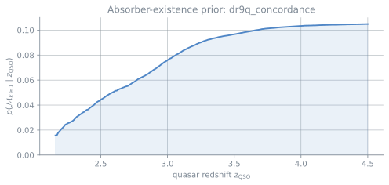
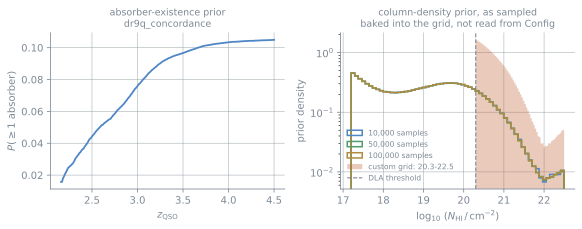

# Customizing the model, the priors, and the sampling

The presets exist so that you do not have to assemble a configuration by hand.
`Config.desi_y3()` is the DESI operating point, and it reproduces the deployed
pipeline's numerics on the surface we have tested. Most users should start
there. This page is for the cases where you do need to change something and
want to understand what changes with it.

Everything below uses the public API and generated data, and every example is
deterministic. The one thing to keep in mind throughout: **a configuration
records what it reproduces.** As soon as you override something scientifically
consequential, the preset name becomes `<base>+modified`, the configuration
digest changes, and the result stops claiming to be the DESI operating point.
This is not a penalty. It is how a catalog from your run tells a later reader
what actually produced it.

```python
from gp_dla_finder import Config

reference = Config.desi_y3_fast()
custom = Config.desi_y3_fast(lsf_kernel="boss-r2000-7tap")

print(reference.preset, reference.digest)  # desi_y3_fast          090ba823...
print(custom.preset, custom.digest)  # desi_y3_fast+modified <different>
print(custom.base_preset)  # desi_y3_fast
```

## What is safe to change, and what is not

A quick map before the details. "Reference fidelity" here means: the run still
reproduces the deployed DESI numerics on the surface we have measured.

| Change | Fidelity | Notes |
|---|---|---|
| `num_samples` + matching `sample_grid` | **retained** | The three packaged grids are the same prior at three budgets |
| `seed` | **retained** | Only affects the multi-absorber resampler |
| `voigt_backend` | **retained** | `numpy` and `libcerf` agree to a measured tolerance |
| `mode="filter"` | **changed** | A screening approximation; see {doc}`filter` |
| `lsf_kernel` | **changed** | A different instrument's resolution |
| A different trained model | **changed** | A different emission prior entirely |
| A rebuilt N_HI sample grid | **changed** | A different absorber prior |
| `enable_tau_eb=False` | **changed** | Turns off the per-spectrum mean-flux fit |
| `quality_policy=None` | **changed** | No catalog selection rule at all |

Nothing in the "changed" column is automatically wrong. These are custom
scientific configurations, and the package records them as such. The important
point is that the reference validation no longer applies without a new check.

## The sample budget

The cheapest knob, and the one with the clearest trade-off. The evidence is a
quasi-Monte-Carlo integral, so more samples means a tighter integral and a finer
grid of candidate absorber positions.

```python
fast = Config.desi_y3_fast()  # 10,000 samples
standard = Config.desi_y3()  # 50,000 samples
refined = Config.desi_y3_refined()  # 100,000 samples
```

**The grid and the budget must agree.** `num_samples` and `sample_grid` are
separate fields, and the preset sets both. If you change one by hand, change the
other:

```python
from gp_dla_finder import available_sample_grids

print(available_sample_grids())
# ('pw14_172_225_10000', 'pw14_172_225_100000', 'pw14_172_225_50000')

config = Config.desi_y3(num_samples=10_000, sample_grid="pw14_172_225_10000")
```

All three packaged grids draw from the same column-density prior. Increasing the
budget does not change what you are integrating; it only changes the numerical
resolution of the integral. The figure below shows the three packaged
histograms lying on top of one another.

## The absorber-existence prior

This is what turns a Bayes factor into a posterior probability. It is derived
from a catalog of sightlines, and it depends on quasar redshift. A spectrum at
$z_{\rm QSO} = 3.5$ has roughly five times the prior absorber probability of one
at $z_{\rm QSO} = 2.2$.

```python
from gp_dla_finder import Config, load_prior

prior = load_prior()  # 'dr9q_concordance'
config = Config.desi_y3_fast()

for z_qso in (2.2, 2.6, 3.0, 3.5):
    print(z_qso, prior.absorber_fraction(z_qso, config.prior_z_qso_increase))
```



*The packaged absorber-existence prior. This is a prior on the model,
$p(\mathcal M_{k\geq1}\mid z_{\rm QSO})$, rather than a statement about where
an absorber lies within one spectrum. The rise with $z_{\rm QSO}$ reflects the
longer searchable path and the catalogue from which the prior was estimated.*

Two knobs here, and they do different things.

`prior_z_qso_increase_kms` sets which catalogued quasars count as neighbours
when the prior is evaluated at a given redshift. Widening it smooths the curve
and borrows statistics from further away in redshift; narrowing it makes the
prior more local and noisier. The deployed value is 30,000 km/s.

Choosing a different prior asset is the larger change. Only one is packaged
today:

```python
from gp_dla_finder import available_priors

print(available_priors())  # ('dr9q_concordance',)
```

If your survey's absorber incidence differs from DR9's, you should derive a
prior from your own catalog rather than quietly rescale this one. The package
does not automate that step yet.

## The column-density prior, and why it needs a grid rebuild

This distinction is easy to miss, so it is worth making explicit.

`Config.log_nhi_range` and `Config.log_nhi_prior_alpha` **describe** the
column-density prior. They do not construct it at run time. The prior is baked
into the QMC sample grid: the grid file carries the `log10 N_HI` coordinate of
every sample, drawn once through the inverse CDF of the Prochaska et al. (2014)
mixture.

So changing `log_nhi_range` alone does not restrict the search to DLAs. It
changes the configuration's description of itself and nothing about what is
sampled. Because that would put a prior in the run record that the calculation
never used, the `Finder` **refuses it**:

```python
Finder(Config.desi_y3(max_absorbers=1, log_nhi_range=(20.3, 22.5)))
# SampleGridMismatch: the configuration describes a different column-density
# prior than the sample grid 'pw14_172_225_50000' it would use ...
```

The same check covers `num_samples` and `log_nhi_prior_alpha`. This is an error,
not a warning, because a reader cannot detect the mismatch from the output
numbers alone: the calculation runs, but the recorded prior is wrong.

### Extending the upper limit to $\log_{10}N_{\rm HI}=23$

The historical pre-DESI implementation sometimes used 23 as its upper limit.
You can make that choice here, but it requires a new grid. The complete example
below builds support over $17.2\leq\log_{10}N_{\rm HI}\leq23.0$ and then gives
the resulting grid to `Finder`; it is not enough to change one configuration
number.

Extending the range can keep a very high-column absorber from landing on the
edge of the grid. It also adds prior volume where the Prochaska et al. spline is
no longer directly constrained and can make an unusually broad feature easier
to overfit as a very large DLA. Treat it as a scientific configuration choice,
record it, and validate it for your sample rather than assuming it is always an
improvement.

### Building and using your own grid

To actually change the prior, build a grid. Nothing needs to go inside the
installed package — the grid lives wherever you put it, and you hand it to the
`Finder` directly.

The complete example is `docs/examples/custom_grid.py`, and it runs as written.

```{literalinclude} examples/custom_grid.py
:language: python
:start-after: "[start:build]"
:end-before: "[end:build]"
```

The builder writes two files: `<name>.npz` with the sample arrays, and
`<name>.json` with the provenance — the name, the prior support, the mixture
weight, the QMC construction and seed, and the array hashes. **Keep them
together.**

Without the `.json`, the arrays still load and you can inspect them, but the
grid states nothing about itself — so nothing can be checked against your
configuration, and `Finder` **refuses to run on it**:

```python
bare = load_sample_grid(path="grids/extended_nhi_2000.npz")  # sidecar deleted
bare.usable_for_inference  # False
Finder(config, grid=bare)
# SampleGridMismatch: ... cannot be used for inference: it carries no usable
# provenance, so nothing about it can be checked against the configuration.
```

This is a hard stop rather than a reduced check. A matching sample count does
not show that the grid used the prior named by the configuration.

```{literalinclude} examples/custom_grid.py
:language: python
:start-after: "[start:load]"
:end-before: "[end:load]"
```

Now the part worth seeing fail. A configuration that still claims the packaged
support is refused, even though the grid is right there:

```{literalinclude} examples/custom_grid.py
:language: python
:start-after: "[start:mismatch]"
:end-before: "[end:mismatch]"
```

Describe the grid you built, and it runs:

```{literalinclude} examples/custom_grid.py
:language: python
:start-after: "[start:run]"
:end-before: "[end:run]"
```

Set `sample_grid` to your grid's name as well. It enters the configuration
digest and is written to the catalog as `GPDLF_SAMPLE_GRID`, so leaving it at a
packaged name would have the file cite a grid the run did not read.



*The right-hand panel shows what a rebuilt grid actually changes. The three
packaged budgets draw from the same prior and lie on top of each other; the
custom grid is a different prior, with no support below the DLA threshold. The
code example above instead shows the separate historical choice of extending
the upper limit to 23.*

A word on the low end of the deployed range. It reaches well below the DLA
threshold, and that is deliberate: in practice a sightline contains LLSs and
sub-DLAs, and a model that cannot represent them will try to explain them with
something else. Removing the low end makes the inference less regularized, not
more focused. The trusted regime for reporting remains $\log_{10} N_{\rm HI} >
20$ — see {doc}`caveats`.

## The trained GP emission model

The model supplies the quasar continuum prior — the mean vector and low-rank
covariance the null model is built from. Two are packaged:

```python
from gp_dla_finder import available_models, load_model, model_provenance

print(available_models())
# ('eboss_dr16q_minus_dr12q', 'phase2_2lpt_loa124_nohcd_nobal_wide_m')

model = load_model("eboss_dr16q_minus_dr12q")
print(model_provenance("eboss_dr16q_minus_dr12q"))
```

Switching models is a real scientific change: the two were trained on different
data, and they encode different beliefs about what a quasar spectrum looks like
before any absorber is added. The default is the one the DESI operating point
uses.

One caveat that applies to the default: it was trained on the same mock suite it
is calibrated against, so figures quoted on that mock are in-sample. That is
recorded in {doc}`caveats` rather than buried here.

## Resolution and the line-spread function

The absorber's Voigt profile is convolved with the instrument's LSF before it is
compared with the data. Two named kernels ship:

```python
from gp_dla_finder.voigt import LSF_KERNELS, PRODUCTION_KERNEL

print(list(LSF_KERNELS))  # ['boss-r2000-7tap', 'desi-r3000-7tap']
print(PRODUCTION_KERNEL)  # 'desi-r3000-7tap'

config = Config.desi_y3(lsf_kernel="boss-r2000-7tap", preset="custom")
```

Pick the one that matches your data. A DESI kernel applied to BOSS spectra makes
the model expect sharper features than the instrument can produce, and the
mismatch shows up as a systematic in the fitted profile rather than as an error.

You can also turn broadening off entirely with `broadening=False`. That is useful
for isolating the effect of the convolution in a test, but it is not a
configuration to run science on: the damping wings of a real DLA are broad enough
that the LSF matters less than for a narrow line, but "less" is not "not at all".

## The mean-flux fit

By default the package fits the effective optical depth per spectrum before
running inference — an empirical-Bayes step that scans a small grid of
multipliers on $\tau_0$ and keeps the best.

```python
config = Config.desi_y3(
    enable_tau_eb=True,
    tau_eb_factors=(0.5, 1.0, 1.5, 2.0, 3.0, 4.0, 5.0, 6.0),
)
```

What you can change here is deliberately narrow:

* `tau_eb_factors` — the multipliers scanned. Widening the grid costs one null
  evidence per extra point. If the best factor lands on an edge, the fit is
  telling you the grid was too narrow, and the result records that as a
  grid-edge flag rather than hiding it.
* `enable_tau_eb=False` — skip the fit and use `prev_tau_0` directly. Faster,
  and a change to the forward model.

Two settings exist in the configuration and are **refused** if you select them:

```python
from gp_dla_finder.finder import Finder

finder = Finder(Config.desi_y3(max_absorbers=1, tau_eb_objective="absorber"))
finder.run(spectrum, targetid=1)  # raises ObjectiveNotSupported

finder = Finder(Config.desi_y3(max_absorbers=1, tau_eb_apply_hcd_mask=True))
finder.run(spectrum, targetid=1)  # raises HCDMaskNotSupported
```

Note where the refusal happens: on `run()`, when the mean-flux fit is reached,
not on `Config` or `Finder` construction. Both are raised rather than returned
as a failed result, because the request is a configuration error rather than
something about the spectrum.

Neither is an oversight. The absorber-model objective was never the deployed
path, and the HCD-mask variant was retracted upstream because at population scale
it over-corrects. The package refuses them rather than falling back quietly to
the supported setting, because a silent fallback would let a run report a
configuration it did not use.

## How many absorbers to search for

The presets carry `max_absorbers=4`, which is the value the deployed
configuration declares. This package evaluates M0, M1 and M2 only, so a `Finder`
built from a bare preset **refuses** rather than quietly stopping at two:

```python
Finder(Config.desi_y3())  # NotImplementedError: max_absorbers=4
Finder(Config.desi_y3(max_absorbers=1))  # the supported default
```

`Finder()` with no argument is `Config.desi_y3(max_absorbers=1)` for this
reason. If you build the configuration yourself, say what you want:

```python
config = Config.desi_y3(max_absorbers=1)  # null versus one absorber
```

The two-absorber path needs a second, separate opt-in:

```python
config = Config.desi_y3_fast(
    max_absorbers=2,
    experimental_multi_absorber=True,
)
```

Both settings are required because the two-absorber model is workable in a
production workflow while its current statistical estimator remains
experimental. It reproduces the legacy implementation on the surface we tested,
but it is weak for close pairs and low signal-to-noise spectra. Robust joint
posterior inference will need an advanced sampler. Read {doc}`caveats` before
using it in an analysis you intend to publish.

## Seeds and reproducibility

The seed matters for exactly one thing: the resampler in the multi-absorber path.
The null and one-absorber evidences are deterministic given the grid.

```python
config = Config.desi_y3_fast(seed=12345)  # reproducible
config = Config.desi_y3_fast(seed=None)  # deliberately stochastic
```

`seed=None` is recorded in a catalog as `GPDLF_SEED = -1` together with
`GPDLF_RNG_MODE = "stochastic"`, so an unseeded run can never be read back as the
deterministic seed 0. The stream itself is recorded too, in
`GPDLF_RNG_ALGORITHM`, because the same seed on a different generator gives
different two-absorber evidences.

## Quality policy

A quality policy decides which spectra are eligible at all. The production
presets name the deployed DESI requirement; `None` means no rule.

```python
from gp_dla_finder.quality import QUALITY_POLICIES

print(list(QUALITY_POLICIES))

config = Config.desi_y3(quality_policy=None, preset="custom")
```

`None` is a legitimate choice when you are doing your own selection upstream. It
is not a neutral default, though — a catalog written from an unfiltered run
describes a different population than one written from a filtered run, and the
policy name travels in the run record so that difference stays visible.

## Putting it together

Here is one complete custom configuration:

```python
from gp_dla_finder import Config
from gp_dla_finder.finder import Finder

config = Config.desi_y3_fast(
    max_absorbers=1,  # the presets declare 4; see below
    lsf_kernel="boss-r2000-7tap",  # BOSS spectra, not DESI
    enable_tau_eb=True,
    seed=20260821,
    preset="custom-boss-fast",  # name it; do not inherit desi_y3_fast
)

finder = Finder(config)
result = finder.run(spectrum, targetid=1)

print(result.provenance["preset"])  # custom-boss-fast
print(result.provenance["base_preset"])  # custom-boss-fast
print(result.provenance["config_digest"])  # what actually decides comparability
```

Naming the preset yourself is worth the extra line. `desi_y3_fast+modified` tells
a reader that something changed but not what it was for; `custom-boss-fast` tells
them what the run is.

## What this page does not cover

* **Training a new GP model.** The package loads trained models; it does not
  train them. That lives in the reference pipeline.
* **A different absorber prior derived from your own catalog.** The loader takes
  a packaged prior by name, and adding one is not yet a public API.
* **Tuning the multi-absorber path.** It is experimental and opt-in, and the
  place to read about its limits is {doc}`caveats` rather than a tuning guide.
