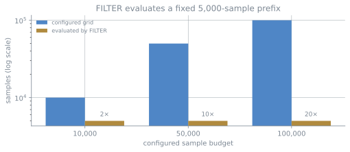

# FILTER: fast screening, not full-grid evidence

FILTER is useful for a quick first pass through many spectra. It does not give
the same calculation as the full grid, so you should treat it as a screening
method. This page shows what it computes and how large the differences were in
our constructed test set.

:::{important}
**FILTER is opt-in.** For v0.1, the production presets use the full configured
QMC grid. You have to request FILTER explicitly, and its output remains labeled
`filter` in the `Result`, each catalog row, and the run record.

```python
Config.desi_y3()  # full grid (default)
Config.desi_y3(filter_low_likelihood=True)  # opt-in screening
```
:::

## A note on the word "exact"

The name `mode="exact"` is there for API compatibility. In practice, it means
*use the whole configured QMC grid instead of a prefix*. It does not mean an
analytic integral, zero numerical error, or proven convergence.

For v0.1, we use the **100,000-sample full-grid result** as a practical
reference. It is already slow on a laptop, and the result still changes between
10,000 and 100,000 samples, so this should not be read as proof of convergence.

## What FILTER computes

For the **one-absorber** evidence, FILTER is not an adaptive approximation. We
verified it bitwise against the reference implementation's `FILTER=1` path. The
region-of-interest refinement does not contribute at $k = 1$; the calculation
uses the same quasi-Monte-Carlo estimator restricted to the first
`max(num_samples // 20, 5000)` grid points.

This has two practical consequences:

* **The saving is not 20× everywhere.** The 5000-sample floor gives ~2× at
  the 10,000-sample operating point, ~10× at 50,000, and reaches ~20× only at
  100,000;
* **The error is deterministic.** A prefix of a low-discrepancy sequence remains
  low-discrepancy. Its error is much smaller than the error from a random
  subsample, but it does not average away.




*The 5,000-sample floor in `max(num_samples // 20, 5000)`, computed with `coarse_scan_size`. At the 10,000- and 100,000-sample operating points, FILTER evaluates the same prefix. The speedup grows while the estimate remains unchanged.*

## Raising `num_samples` does not improve a FILTER result

At both the 10,000- and 100,000-sample operating points, FILTER evaluated
**exactly 5000 samples** and returned the same answer: identical posteriors to
within 3.9 × 10⁻¹⁵ and log-evidences to within 2.3 × 10⁻¹³ nat across the corpus,
which is floating-point round-off.

The full-grid estimator continues to change. Its posterior for the marginal
case increases from 0.5008 at 10,000 samples to 0.5176 at 100,000 samples.

:::{important}
The gap between the two therefore **grows** with `num_samples`. A larger grid
changes only the full-grid result. FILTER appears faster by comparison, but the
screening calculation itself has not improved.
:::

## Runtime and measured differences

Measured over a fifteen-case generated corpus (`tools/compare_filter.py`), with
classification taken at thresholds of 0.5, 0.9 and 0.98, **against the adopted
100k full-grid reference**:

| operating point | classification differences | worst \|Δ p_absorber\| | worst \|Δ log Z\| | speedup |
|---|---|---|---|---|
| 10,000 samples | **1 / 15** | 8.3 × 10⁻³ | 32.7 nat | ~2× |
| 100,000 samples | **3 / 15** | 2.0 × 10⁻² | 178.3 nat | ~20× |

**Classification can differ.** An earlier eight-case corpus showed no
differences because every posterior was saturated at 1.000000. In the present
corpus, cases constructed to lie near a threshold can fall on opposite sides:

| case | 100k full-grid | filter | threshold |
|---|---|---|---|
| `marginal-p050` | 0.51764 | 0.49780 | 0.5 |
| `marginal-p090` | 0.90072 | 0.89123 | 0.9 |
| `marginal-p098` | 0.97932 | 0.98275 | 0.98 |

All three appear at 100,000 samples; at 10,000 only `marginal-p050` does. Both
directions occur. For `marginal-p098`, FILTER crosses the threshold while the
100,000-sample full-grid reference does not.

:::{warning}
**The reference also moves.** `marginal-p090` and `marginal-p098` change sides
between the 10,000- and 100,000-sample full-grid results. So we should not say
that FILTER is wrong and the full grid is physically right. The 100,000-sample
result is simply the practical reference we use for v0.1.
:::

**Reported evidences move much more than posteriors.** The high-column DLA moves
by 178 nat while its posterior remains saturated at 1.0. This difference matters
for log Bayes factors, model-comparison statistics, and downstream analyses that
use `log Z`.

**Multiple absorbers were not a special failure mode in this small corpus.** The
three cases, with two separated, two blended, and strong-plus-weak absorbers,
showed no classification differences and changed by at most 21 nat. The model
selection still compares the null model with a one-absorber model. These results
do not validate multi-absorber inference; {doc}`tutorial` explains that the
package reports at most one candidate.

:::{warning}
If you need model comparison, a column-density distribution fit, an
evidence-weighted stack, or a posterior near a decision threshold, rerun the
full-grid path. FILTER is mainly for the rough first look.
:::

:::{note}
This corpus is fifteen *generated* spectra. The marginal cases were constructed by
bisecting on column density until the full-grid posterior landed on a threshold,
so **3/15 reflects how the corpus was built and is not a survey error rate**. The
useful conclusion is that decision differences do occur and can go in either
direction. FILTER remains supported, opt-in, and provisional.
:::

## The screening score

In FILTER mode, each absorber row carries `GPDLF_SCREENING_SCORE`, the prefix log
Bayes factor for absorber over null. Use it as a **ranking statistic**, not a
probability or full-grid evidence. In full-grid mode it is `NaN`, which just
means that no screening step was run.

## Reproducing it

```bash
python tools/compare_filter.py --samples 10000 --json filter_10k.json
python tools/compare_filter.py --samples 100000 --json filter_100k.json
```

The 100,000-sample run takes roughly ten minutes on a laptop.
