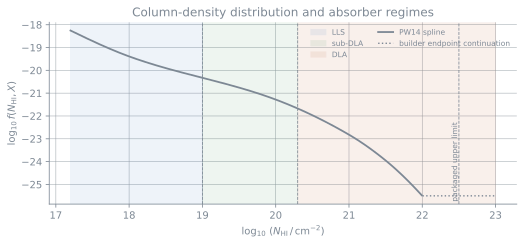
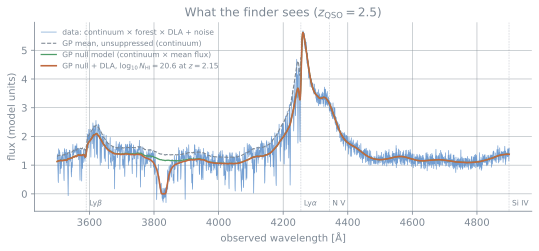
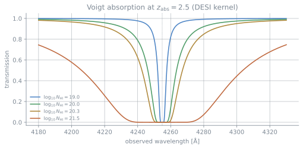
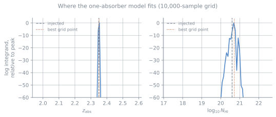
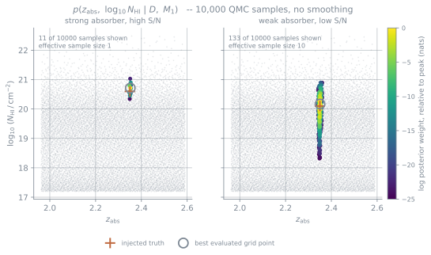

# Finding damped Lyman-α absorbers with Gaussian processes

This tutorial follows the scientific workflow in the reference implementation's
notebook, `tutorials/01_lyman_alpha_absorption_detection.ipynb` in
[`desi_gpy_dla_detection`](https://github.com/jibanCat/desi_gpy_dla_detection)
(MIT, Ming-Feng Ho). The examples have been rewritten for this package's API.

Everything on this page uses the current package API. The test suite also runs
the final quick-start script, which keeps the example synchronized with the
package.

## Where this method comes from

The method was introduced by Garnett et al. (2017) and extended by Ho et al.
(2020, 2021). It is useful to think about it in three steps:

- **the quasar continuum is learned rather than fitted independently for every
  object.** A Gaussian process over rest-frame wavelength, trained on many
  spectra, replaces the usual
  per-spectrum continuum fit, so the continuum carries an uncertainty the
  inference can use instead of a point estimate it has to trust
  ([Garnett et al. 2017](https://arxiv.org/abs/1605.04460));
- **an absorber changes the forward model.** Instead of first identifying a
  feature and then fitting it, we write down what the spectrum would look like
  with an absorber and compare that model with the null model;
- **the comparison is Bayesian model selection.** Marginalise over where the
  absorber is and how much gas it has, then compare model evidences. That is
  what turns "the fit looks better" into a probability
  ([Ho et al. 2020](https://arxiv.org/abs/2003.11036),
  [2021](https://arxiv.org/abs/2103.10964)).

:::{note}
**The method, the reference code, and this package are not quite the same
thing.**

The papers describe the method. The reference implementation is the DESI
production pipeline from which this package was ported. The supported package
workflow compares the null and one-absorber models, and agrees bitwise with the
reference on the generated spectra we tested. An opt-in M0/M1/M2 calculation is
also available and is workable in a production workflow. Its statistical
estimator is still experimental. It follows the reference on the cases we
checked, but robust posterior inference, especially for close pairs, will need
an advanced sampler. Where the package differs from the papers or reference
code, we point it out explicitly.
:::

### The Bayesian model in equations

For one spectrum, write the usable data as

$$
\mathcal{D}=\{(\lambda_i,y_i,\sigma_i^2)\}_{i=1}^{n},
\qquad \sigma_i^2={\rm ivar}_i^{-1},
$$

after the bad-pixel mask has removed pixels we should not fit. The intrinsic
quasar flux is a Gaussian process on rest-frame wavelength,

$$
\mathbf q \sim \mathcal N(\boldsymbol\mu,\,\mathbf K),
\qquad \mathbf K=\mathbf M\mathbf M^{\mathsf T}.
$$

$\boldsymbol\mu$ is the trained mean spectrum, while the columns of
$\mathbf M$ describe correlated ways in which a real quasar may differ from
that mean. Let $\mathbf a$ be the mean Lyman-forest transmission and
$\boldsymbol\omega^2$ the assembled extra variance from unresolved absorption.
For Lyman-series transition $\ell$ at rest wavelength $\lambda_\ell$ and
oscillator strength $f_\ell$, the package uses

$$
1+z_{\ell i}=\frac{\lambda_i}{\lambda_\ell},
\qquad
\tau_{\ell i}=\tau_0
\frac{f_\ell\lambda_\ell}{f_\alpha\lambda_\alpha}
(1+z_{\ell i})^\beta\,
\mathbb I(z_{\ell i}\leq z_{\rm QSO}),
\qquad
a_i=\exp\!\left(-\sum_\ell\tau_{\ell i}\right).
$$

Here $\tau_0$ and $\beta$ set the effective-optical-depth relation and
$\mathbb I$ switches off absorption beyond the quasar. If
$\ell_{\omega,i}$ is the interpolated trained log-noise amplitude, the assembled
absorption-noise variance is

$$
\omega_i^2=\exp(2\ell_{\omega,i})\,s_i^2a_i^2,
\qquad
s_i=1-\exp\!\left(-\sum_\ell\tau^{\rm learned}_{\ell i}\right)+\exp(c_0),
$$

where $\tau^{\rm learned}_{\ell i}$ and $c_0$ are learned with the GP model.
After interpolation onto this spectrum, define

$$
\boldsymbol\mu_0=\mathbf a\odot\boldsymbol\mu,
\qquad
\mathbf L_0=\operatorname{diag}(\mathbf a)\mathbf M,
\qquad
\mathbf C_0=\mathbf L_0\mathbf L_0^{\mathsf T}
 +\operatorname{diag}(\boldsymbol\omega^2+\boldsymbol\sigma^2).
$$

Here $\odot$ means element-by-element multiplication and
$\boldsymbol\sigma^2$ is the measured pixel-noise variance. Under the null
model,

$$
\mathcal M_0:\qquad
\mathbf y\sim\mathcal N(\boldsymbol\mu_0,\mathbf C_0).
$$

One absorber has parameters
$\boldsymbol\theta=(z_{\rm abs},\log_{10}N_{\rm HI})$ and Voigt transmission
$\mathbf t(\boldsymbol\theta)$. With
$\mathbf T_{\boldsymbol\theta}=\operatorname{diag}[\mathbf t(\boldsymbol\theta)]$,
the one-absorber model is

$$
\mathcal M_1:\qquad
\mathbf y\sim\mathcal N\!\left(
\mathbf T_{\boldsymbol\theta}\boldsymbol\mu_0,\,
\mathbf T_{\boldsymbol\theta}
 [\mathbf L_0\mathbf L_0^{\mathsf T}+\operatorname{diag}(\boldsymbol\omega^2)]
 \mathbf T_{\boldsymbol\theta}
 +\operatorname{diag}(\boldsymbol\sigma^2)
\right).
$$

The absorber multiplies the astrophysical mean and covariance, but not the
instrumental noise. For two absorbers,
$\boldsymbol\Theta_2=(\boldsymbol\theta_1,\boldsymbol\theta_2)$ and the total
transmission is $\mathbf t(\boldsymbol\theta_1)\odot
\mathbf t(\boldsymbol\theta_2)$.

For a model $\mathcal M_k$, the evidence and model posterior are

$$
Z_k\equiv p(\mathcal D\mid\mathcal M_k)
=\int p(\mathcal D\mid\boldsymbol\Theta_k,\mathcal M_k)
\,p(\boldsymbol\Theta_k\mid\mathcal M_k)\,\mathrm d\boldsymbol\Theta_k,
\qquad
p(\mathcal M_k\mid\mathcal D)
=\frac{Z_k\,p(\mathcal M_k)}{\sum_j Z_j\,p(\mathcal M_j)}.
$$

The current package evaluates $Z_1$ on a quasi-Monte-Carlo grid. The M2 path
uses the reference pipeline's sequential resampling estimator. That path runs
and can write production-compatible outputs, but its statistical interpretation
remains experimental until a sampler that treats the joint posterior and model
selection more completely is available. In these equations,
$p(\boldsymbol\Theta_k\mid\mathcal M_k)$ is the absorber-parameter prior: the
redshift coordinate spans the allowed search window and the column-density
coordinate follows the configured PW14-plus-uniform mixture. The separate model
prior $p(\mathcal M_k)$ comes from the packaged sightline catalogue and depends
on $z_{\rm QSO}$.

## What we are looking for

A quasar's light passes through intervening neutral hydrogen, and each absorber
leaves a Lyman-α feature with rest wavelength 1215.67 Å. An absorber at
$z_{\rm abs}$ therefore appears at $1215.67\,(1 + z_{\rm abs})$ Å. We usually
classify these systems by neutral-hydrogen column density:

| type | column density $N_{\rm HI}$ (cm⁻²) |
|---|---|
| Lyman-limit system (LLS) | $10^{17.2}\leq N_{\rm HI}<10^{19}$ |
| sub-damped Lyman-α (sub-DLA) | $10^{19}\leq N_{\rm HI}<10^{20.3}$ |
| damped Lyman-α (DLA) | $\geq 10^{20.3}$ |



*The Prochaska et al. (2014) column-density distribution function used to build
the package prior. The colored regions show the conventional LLS, sub-DLA and
DLA ranges. The spline is measured through $\log_{10}N_{\rm HI}=22$; the
builder holds its endpoint fixed above that value, so the dotted continuation
to the packaged limit at 22.5 should not be read as an additional measurement.*

Above roughly $10^{20.3}\,\mathrm{cm}^{-2}$, radiation damping produces broad
Lorentzian wings. These wings allow us to identify a DLA even in a
low-resolution spectrum. This package should therefore be treated as a DLA
finder. The lower-column-density part of the prior is still useful: real
sightlines contain LLSs and sub-DLAs, and a model that cannot represent them
would bias the DLA inference. We have not validated those systems well enough
to use them as independent science-catalog targets.




*Built from the package's own model and code. A Gaussian process has both a mean
$\boldsymbol\mu$ and a covariance $\mathbf K=\mathbf M\mathbf M^{\mathsf T}$.
The dashed line shows only the trained mean, or unsuppressed continuum. The
covariance is not another curve: it describes correlated uncertainty around
that mean and enters the likelihood through $\mathbf C$. Green is the GP null
mean after applying mean-forest transmission, red adds one damped absorber at
$z=2.15$, and blue is the generated data with a stochastic Lyman-α forest and
noise.*

:::{warning}
The spectra in this section come from a **demo generator**. It is for
demonstrations, controlled injections and bounded validation tests. It is not a
validated cosmological Lyman-α mock generator, and it should not be used to
produce a science mock catalogue. It is **not** a substitute for
`quickquasars`, [`fake_spectra`](https://github.com/sbird/fake_spectra), or a
survey mock, and results measured on it are not evidence about catalogue
performance on real or mock survey data. Peculiar velocities, redshift-space
distortion, a coupled cosmological density/velocity field, and a full
temperature–density relation are all absent.
:::

*The forest here is illustrative: it is a stochastic construction, not a
cosmological mock. It uses the fluctuating Gunn-Peterson approximation on a
lognormal density field. We generate it on a velocity grid eight times finer
than the plotted grid, apply the broadening there, and rebin afterwards. A
50 km/s Gaussian sets the field smoothing, corresponding to a 1/e transmission
correlation length near 110 km/s. Thermal broadening assumes
$T = 2\times10^{4}$ K, giving $b \approx 18$ km/s and a Gaussian width of
$b/\sqrt{2}$. The amplitude is chosen to reproduce the same mean-flux relation
used by the inference. Instrumental broadening is a separate step and is not
included here. Peculiar velocities and redshift-space distortion are also out
of scope; treating them properly needs a velocity field coupled to the density
field.*

*Two things to take from it. The model is **smooth**: it carries the mean forest
suppression, not individual forest lines, which to it are noise. And what marks
the DLA out is not depth but **width**: its damping wings span tens of ångströms
where forest lines are narrow.*

## The forward model: a Voigt profile

We model one absorber with a Voigt profile, which combines natural line
broadening with thermal motion. We sum over Lyman-series transitions and then
convolve the result with the instrument line-spread function:

$$
\tau(\lambda) = N_{\rm HI} \sum_j a_j \, V\!\left(v_j(\lambda); \sigma, \gamma_j\right),
\qquad
\text{transmission} = e^{-\tau}.
$$

```python
import numpy as np
from gp_dla_finder.voigt import voigt_absorption, kernel_half_width, PRODUCTION_KERNEL

# Observed-frame grid, padded by the LSF half-width so the convolution has no
# edge effect.
step = 0.8
half = kernel_half_width(PRODUCTION_KERNEL)
wave = np.arange(3600.0, 5600.0, step)
padded = np.concatenate(
    [
        wave[0] - step * np.arange(half, 0, -1),
        wave,
        wave[-1] + step * np.arange(1, half + 1),
    ]
)

transmission = voigt_absorption(padded, nhi=10**20.5, z_dla=2.3, num_lines=3)
transmission.shape  # == wave.shape
```

One practical detail matters here: choose the line-spread function that matches
your data. The configuration records the kernel by name because the wrong kernel
changes the inferred profile shape.

```python
from gp_dla_finder.voigt import LSF_KERNELS

sorted(LSF_KERNELS)  # ['boss-r2000-7tap', 'desi-r3000-7tap']
```




*Transmission through an absorber at $z_{\rm abs} = 2.5$, computed with `voigt_absorption` and the production DESI kernel. The damping wings are what make a DLA identifiable: at $\log_{10} N_{\rm HI} = 21.5$ the profile depresses the spectrum over more than 100 Å, while a sub-DLA at 19.0 is a narrow line.*

## The emission model: a Gaussian process

The unabsorbed quasar spectrum is not known in advance. We describe it with a
Gaussian process trained on many spectra, rather than fitting one fixed
continuum to each object. This matters because uncertainty in the continuum can
then propagate into the absorber comparison. The model contains a mean vector
$\mu$, a low-rank covariance factor $M$, and an absorption-noise term $\omega$.

```python
from gp_dla_finder import load_model
from gp_dla_finder.config import Config

model = load_model()  # the deployed DESI Y3 trained model
config = Config.desi_y3_fast()  # a named preset; a bare Config() raises
model.rank  # 30 eigenvectors
```

Choose a named preset for each run. A bare `Config()` raises rather than quietly
choosing an operating point; {doc}`caveats` explains the reason for this choice.

## Bayesian model selection

We compare two models for each spectrum:

**Null model** $\mathcal{M}_0$
: the GP emission model alone, with no intervening absorber.

**Absorber model** $\mathcal{M}_1$
: the same GP multiplied by a Voigt profile whose redshift and column density are
  unknown and are marginalised over.

The evidence for the absorber model is an integral over those unknowns,

$$
p(D \mid \mathcal{M}_1) = \int p(D \mid z_{\rm abs}, N_{\rm HI})\,
    p(z_{\rm abs}, N_{\rm HI}) \; \mathrm{d}z_{\rm abs}\, \mathrm{d}N_{\rm HI},
$$

evaluated as a quasi-Monte-Carlo average over a fixed, low-discrepancy sample
grid.

```python
from gp_dla_finder import load_sample_grid
from gp_dla_finder.gp.spectrum import Spectrum, prepare_spectrum
from gp_dla_finder.gp.evidence import (
    assemble_model,
    null_log_evidence,
    one_absorber_log_evidence,
)

spectrum = Spectrum(wavelength=wave, flux=flux, ivar=ivar, z_qso=2.6, mask=mask)

prepared = prepare_spectrum(spectrum, model, config)  # normalise, mask, pad
assembled = assemble_model(prepared, model, config)  # interpolate + mean flux
grid = load_sample_grid(config.sample_grid)

log_z_null = null_log_evidence(prepared, assembled)
log_z_one = one_absorber_log_evidence(prepared, assembled, grid, config, mode="exact")

log_bayes_factor = log_z_one - log_z_null
```

A positive log Bayes factor favors the absorber model. If you want a posterior
probability, you also need a prior for how often absorbers occur at this quasar
redshift:

```python
from gp_dla_finder import load_prior

prior = load_prior()
log_prior_one = prior.log_priors(spectrum.z_qso, 1, config.prior_z_qso_increase)[0]
log_prior_null = prior.log_prior_no_absorber(
    spectrum.z_qso, config.prior_z_qso_increase
)
```




*The per-sample integrand from a 10,000-sample run on a spectrum with an absorber injected at $z = 2.35$, $\log_{10} N_{\rm HI} = 20.6$. Redshift is tightly localized, while column density is more weakly constrained. The best evaluated grid point is near the injected value and is usable as a preliminary location, but it is not yet a validated science estimate.*

### The conditional posterior over $(z_{\rm abs}, \log_{10} N_{\rm HI})$

The evidence is an integral, so the samples that build it also describe the
posterior over the absorber's parameters. The grid draws its samples from the
prior $\pi(\theta)$, so the per-sample integrand is $\log L(\theta_i)$ up to a
constant, and the self-normalized weight

$$
w_i \;=\; \frac{\exp(\log L_i)}{\sum_j \exp(\log L_j)}
$$

is $p(z_{\rm abs}, \log_{10} N_{\rm HI} \mid D, M_1)$ evaluated at that sample.
You can compute it yourself:

```python
import numpy as np

from gp_dla_finder.gp.evidence import absorber_search_window

log_z_one, samples = one_absorber_log_evidence(
    prepared, assembled, grid, config, mode="exact", return_samples=True
)

z_min, z_max = absorber_search_window(prepared, config)
z_samples = grid.sample_redshifts(z_min, z_max)
log_nhi_samples = np.log10(grid.nhi_samples)

# Self-normalized posterior weights, computed in log space.
finite = np.isfinite(samples)
log_w = samples - np.max(samples[finite])
weights = np.where(finite, np.exp(log_w), 0.0)
weights /= weights.sum()

# How many of the samples the answer actually rests on.
effective_sample_size = 1.0 / np.sum(weights**2)
```



*The QMC samples themselves, with no smoothing, density estimate or contours.
The faint gray layer is all 10,000 samples, which is the grid the search
covered; the colored layer is every sample within 25 nats of the peak, colored
by $\log(w_i / w_{\max})$. The cross marks the injected absorber and the open
circle marks the best evaluated grid point; they are different things and do
not coincide.*

*The 25-nat limit is a **display threshold, not an inference cut**. Every one
of the 10,000 samples contributes to the evidence integral exactly as it did
before the figure was drawn. The limit only decides which samples get a color
instead of staying gray, and it is set where it is because $e^{-25}$ is about
$10^{-11}$ of the peak weight, far below anything that changes the integral.*

Two things in that figure are worth dwelling on, because they explain choices
the package makes elsewhere.

**The posterior is extremely concentrated.** For a strong absorber in a clean
spectrum, 11 of the 10,000 samples fall within 25 nats of the peak and the
effective sample size is **about 1**. The integral rests on essentially one
sample. This is a property of the inference, not of the plot: a damped profile
at high signal-to-noise is a sharp likelihood, and a grid drawn from a broad
prior places few samples inside it.

**The two parameters are not equally well constrained.** Redshift is pinned by
the line center. Column density is set by the width of the damping wings, and
at low signal-to-noise it stretches into the vertical ridge in the right-hand
panel: the same redshift, a decade of column density, and comparable likelihood.

This is why the package reports the **best evaluated grid point** and leaves the
uncertainties as `NaN`. With an effective sample size near 1, a posterior mean
would mostly summarize one grid point, and its standard deviation would be
misleading. You can still compute moments from these weights, but if you do,
report the effective sample size beside them and read {doc}`caveats` first.

## Full grid or quick screening

`mode="exact"` evaluates the full configured grid. `mode="filter"` only uses a
prefix, so it is much faster, but the result is a **screening score** rather than
a full-grid evidence. FILTER is useful for a quick first look. If a candidate is
near your detection threshold, or the later analysis depends on the evidence,
we recommend rerunning the full-grid calculation. The measured differences are
in {doc}`filter`.

## Running the full workflow

You normally do not need to call each step separately. Pass one spectrum to
{class}`~gp_dla_finder.finder.Finder` and inspect the `Result`.

:::{note}
Every snippet in this section is included verbatim from
{download}`docs/examples/quickstart.py <examples/quickstart.py>`, which the test
suite executes. What you read here is what runs.
:::

```{literalinclude} examples/quickstart.py
:language: python
:start-after: "[start:imports]"
:end-before: "[end:imports]"
```

Your data goes in a {class}`~gp_dla_finder.gp.spectrum.Spectrum`:

```{literalinclude} examples/quickstart.py
:language: python
:start-after: "[start:spectrum]"
:end-before: "[end:spectrum]"
```

Then run it:

```{literalinclude} examples/quickstart.py
:language: python
:start-after: "[start:run]"
:end-before: "[end:run]"
```

`run()` gives you a Result even when it cannot process the spectrum. Check
`result.status` before reading `p_absorber`. If the run is incomplete, the
inference and uncertainty fields are `NaN`, not `None`.

### A candidate is not a detection

The example prints a candidate even though `p_absorber` is about 0.003 and no
absorber was injected. This is expected, because a candidate location and a
detection answer different questions.

`absorber_candidates` records **where the one-absorber model fits best**. This
location exists for any spectrum, including one without an absorber:

```python
len(result.absorber_candidates) == 1  # the search ran
result.detected(0.98)  # a DLA was found
```

The first line says that the search ran and found a best grid location. The
second asks whether the absorber probability crosses a threshold. You need to
supply that threshold because the choice belongs to your analysis rather than
to the library.

### Treat the grid points as preliminary estimates

`grid_z_abs` and `grid_log_nhi` identify the sample-grid point with the largest
integrand contribution. They are usable for locating and inspecting a candidate,
but probably not reliable enough to quote as science measurements yet. Their
uncertainties remain `NaN` because the package does not yet provide validated
posterior summaries. See {doc}`caveats`.

### Writing a catalog

Results go to FITS through the catalog writer:

```{literalinclude} examples/quickstart.py
:language: python
:start-after: "[start:catalogue]"
:end-before: "[end:catalogue]"
```

Every result in one catalog must agree on its run-defining provenance, including
the preset, model, prior, sample grid, backend, and compatibility profile. The
file contains one run record, so incompatible results cannot be combined. The
evidence mode may be mixed; in that case the run is labeled `mixed` and each row
retains its own mode.

{doc}`catalogue` describes the strict legacy and extended products, including
the meaning of each column.

## Running the two-absorber model

The two-absorber model is part of the DESI working pipeline, so the public
package includes it even though the current statistical estimator remains
experimental. This deterministic injection shows the complete M0/M1/M2
workflow. It is a code-path demonstration, not a survey validation set.

```{literalinclude} examples/two_absorbers.py
:language: python
:start-after: "[start:spectrum]"
:end-before: "[end:spectrum]"
```

Both opt-ins are deliberate: `max_absorbers=2` states the requested model
ladder, while `experimental_multi_absorber=True` acknowledges the present
estimator's limitations.

```{literalinclude} examples/two_absorbers.py
:language: python
:start-after: "[start:run]"
:end-before: "[end:run]"
```

For a clean separated pair, the example normally selects $\mathcal M_2$ and
returns two candidates. The same calculation is less reliable for close or
low-signal pairs. An advanced sampler such as RJMCMC or nested sampling is the
longer-term route if absorber number and absorber parameters need to be inferred
together.

## What still needs work

The M0/M1 workflow is the statistically supported path. The opt-in M0/M1/M2
ladder is workable in production and writes the same flat catalogue structure
used by the DESI pipeline, but its estimator remains statistically experimental.
It is useful for reference-fidelity work and separated pairs, while close pairs
and low-signal pairs need broader validation. Searches above two absorbers are
not implemented.

The package also does not yet provide validated point estimates or
uncertainties for $(z_{\rm abs}, \log_{10} N_{\rm HI})$, and `run()` still takes
one spectrum rather than managing a parallel survey workflow. Per-spectrum
mean-flux fitting is already part of the supported path.
